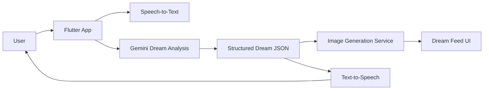

# Dream Reader AI

AI-powered dream journaling app with speech-to-text capture, multilingual LLM interpretation, and generated visual artifacts.

## Problem
Dream journaling apps are usually static note tools with no intelligence. Users want fast capture, interpretation, and reflection loops across voice and text without bouncing between separate apps for transcription, analysis, and image generation.

## Business value / ICP
- **ICP:** wellness product teams, journaling startups, and AI-first consumer app builders.
- Converts raw user voice or text into a structured interpretation, guidance, and a visual artifact.
- Demonstrates a production-relevant multimodal mobile AI pattern: capture, infer, generate, share.

## Demo
- [ ] Add GIF: voice capture → interpretation → image generation
- [ ] Add screenshot: analysis feed
- [ ] Add screenshot: share card export

## Architecture


## AI pipeline
1. Capture dream input via microphone or text.
2. Send the dream to Gemini with a structured JSON contract.
3. Parse interpretation, psychological insight, guidance, and archetypal theme.
4. Use the archetypal theme to generate visual output.
5. Render the interpretation feed and optionally speak the result back to the user.

## API / feature overview
- Voice input with locale-aware speech recognition
- Multilingual interpretation output
- Structured JSON prompting for safer parsing
- Image generation with fallback behavior
- Shareable dream cards
- Text-to-speech playback

## Local setup
```bash
flutter pub get
cp .env.example .env
# fill GEMINI_API_KEY
# optionally fill OPENAI_API_KEY for DALL-E; otherwise fallback image generation is used
flutter run
```

You can also supply keys with Dart defines:

```bash
flutter run \
  --dart-define=GEMINI_API_KEY=your_key \
  --dart-define=OPENAI_API_KEY=your_key
```

## Deployment
- Flutter mobile and web targets
- Recommended web deployment: containerized Flutter web build behind Nginx
- CI pipeline should publish build artifacts and block merges on analyze/test/build failures

## Evaluation metrics (quality, latency, cost)
- **Quality:** JSON validity rate, interpretation coherence, guidance usefulness
- **Latency:** p50/p95 time from submission to analysis response and image availability
- **Cost:** average text-generation cost and image-generation cost per dream
- **Reliability:** provider error rate and fallback activation rate

See `docs/evaluation.md` for a baseline evaluation protocol.

## Roadmap
- [ ] Add deterministic prompt/eval harness
- [ ] Add offline queue + retry for unstable mobile networks
- [ ] Add moderation and safety filters for unsafe text/image outputs
- [ ] Add prompt/version experiments and analytics

## Why this matters for AI teams
This repo demonstrates end-to-end AI product execution: mobile UX, LLM orchestration, multimodal output, provider fallback behavior, and measurable quality/cost tradeoffs.
